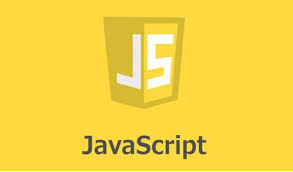
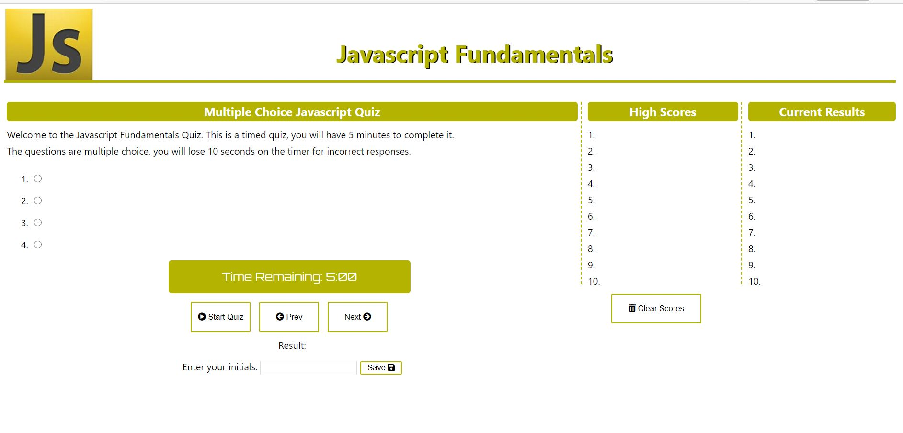
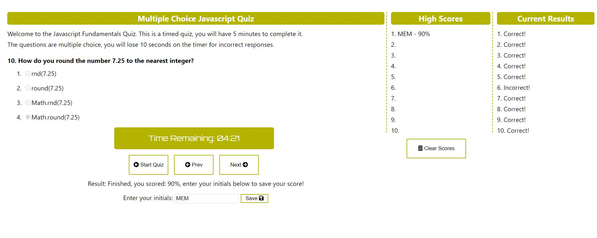

# 💻 Javascript Fundamentals

This application is a 10 question quiz on Javascript Fundamentals. The quiz is multiple choice and is timed, it also includes the criteria below.

---

## 📋 Criteria

- You will have 5 minutes 🕔 to complete the quiz
- A 10 second penalty will be assessed for incorrect answers
- Questions are multiple choice and cannot be changed
- The quiz ✏️ will allow you to save your initials to a high score list
- Results for each question are displayed once answered
- An option to clear the high score history

---

## 1️⃣ Steps used

1. Created application structure with HTML using placeholder tags for Javascript.
2. Added all JS variables to reference the HTML page.
3. Created a timer function to allow for a 5 minute countdown.
4. Added functions to handle the question array, button click events, radio button events, and score calculation.
5. Added functions for local storage using an array containing JSON objects.
6. Added a function to retrieve the local storage and sort based on the test score.
7. Added all stying with CSS and logic to allow the test to be taken again and the high scores to be cleared.

---

## 📸 Screenshots

**Quiz Home Screen**

**Test Results Example**

Final results: [Javascript Quiz](https://malmason.github.io/javascript-quiz/)

---

## 📱 Contact

Malcolm Mason - [Github](https://github.com/malmason) Email: [Malcolm](mailto:malmason66@gmail.com) 📧

---

&copy; 2021 Malcolm Mason
